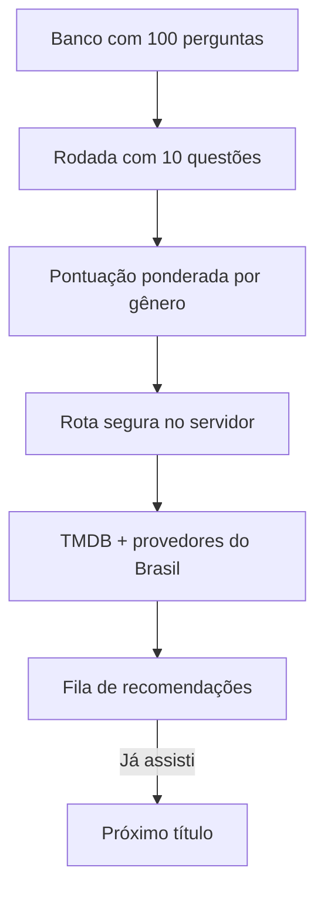

# CineQuiz BR

[](https://github.com/pfutagawa/movie-quiz-recommendation-app/actions/workflows/ci.yml)
[](LICENSE)

Um quiz gamificado de cinema e televisão que transforma o desempenho do jogador em uma fila de recomendações disponíveis nos serviços de streaming do Brasil.

> **Acerte. Descubra. Dê play.**

**[Abrir demonstração funcional](https://cinequiz-br.mybetterhalf47092.chatgpt.site)**

## O produto

O CineQuiz não pergunta ao usuário quais gêneros ele prefere. A recomendação nasce dos acertos em uma rodada de conhecimento cinematográfico:

1. O app sorteia dez perguntas de um banco com 100 questões.
2. Cinco gêneros são representados em cada rodada, com duas perguntas por gênero.
3. Questões fáceis, médias e difíceis valem um, dois e três pontos.
4. Os gêneros de melhor desempenho alimentam a busca de filmes e séries.
5. O botão **Já assisti** registra o título apenas no dispositivo e avança na fila sem exigir um novo quiz.

## Principais recursos

- Banco local com **100 perguntas**, dez gêneros e três níveis de dificuldade.
- Sorteio equilibrado para que uma única categoria não domine a rodada.
- Feedback imediato acompanhado de uma explicação curta.
- Perfil final, pontuação por gênero e fila com até oito recomendações.
- Filmes e séries disponíveis por assinatura no Brasil, com foco em Netflix, Prime Video, Disney+ e Max.
- Histórico de títulos já assistidos salvo em `localStorage`.
- Modo demonstrativo funcional quando a API ainda não está configurada.
- Interface responsiva, navegação por teclado e respeito à preferência de movimento reduzido.

## Arquitetura



A interface nunca recebe a chave da API. O navegador consulta apenas a rota interna `/api/recommendations`, que acessa o TMDB no servidor e devolve os dados necessários ao cartão de recomendação.

Não foi adotado banco de dados nesta versão: perguntas são conteúdo versionado no Git e o histórico é local ao dispositivo. A separação entre dados, regras do quiz e integração externa permite migrar as perguntas para SQL/D1 futuramente sem reescrever a interface.

## Tecnologias

- React 19 e TypeScript
- Next.js 16 com Vinext/Vite
- API do TMDB e dados de disponibilidade por provedor
- CSS responsivo sem biblioteca de componentes
- Node Test Runner para validação do banco e das rotas renderizadas

## Configuração da API

Crie um arquivo `.env.local` a partir de `.env.example` e preencha **somente uma** das credenciais:

```bash
TMDB_API_READ_TOKEN=seu_token_de_leitura
# ou
TMDB_API_KEY=sua_chave_v3
```

O arquivo com a credencial real é ignorado pelo Git. Não coloque tokens diretamente no código, no README ou em commits.

Sem credencial, o produto permanece navegável em modo demonstrativo. Nesse modo, a disponibilidade em streaming não é afirmada como atual.

## Executar localmente

Requer Node.js 22.13 ou superior.

```bash
npm install
npm run dev
```

Para validar o projeto:

```bash
npm run lint
npm test
```

## Estrutura principal

```text
app/
  api/recommendations/route.ts  API interna e segura
  page.tsx                      fluxo completo do produto
data/questions.json             banco de 100 perguntas
lib/quiz.ts                     sorteio, pontuação e perfil
lib/recommendations.ts          integração TMDB e fila demonstrativa
tests/                          testes do banco, renderização e API
```

## Próximas expansões

- Conta opcional para sincronizar histórico entre dispositivos.
- Painel editorial para revisar e publicar novas perguntas.
- Conquistas, sequências diárias e placar sem expor respostas.
- Filtros de acessibilidade e duração depois do resultado, sem alterar o cálculo do quiz.
- Camada SQL/D1 quando o conteúdo passar a ser administrado pela aplicação.

## Créditos de dados

Este produto usa a API do TMDB, mas não é endossado nem certificado pelo TMDB. Os dados de disponibilidade são fornecidos pela parceria do TMDB com o [JustWatch](https://www.justwatch.com/br). A disponibilidade pode mudar; o link de detalhes deve ser consultado antes de assistir.

## Licença

MIT.
